_This post is based on the wonderful CC-licensed book, "Introduction to the Modeling and Analysis of Complex Systems", by Hiroki Sayama._

## Introduction

What are complex systems? The language of modern science. The point of this post is that we hack some complex systems models together in R in increasing complexity and see the models in action for ourselves.

> Complex systems are networks made of a number of components that interact with each other, typically in a nonlinear fashion. Complex systems may arise and evolve through self-organization, such that they are neither completely regular nor completely random, permitting the development of emergent behavior at macroscopic scales. - Hiroki Sayama

```{r, echo = FALSE}
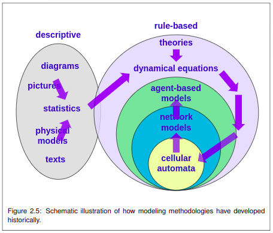
```

```{r, echo=FALSE, warning=FALSE, message=FALSE, error = FALSE}
knitr::opts_chunk$set(warning = FALSE, error = FALSE, message = FALSE)

library(tidyverse)
library(tidygraph)
library(gganimate)
library(ggraph)

library(igraphdata)
data(karate)

visualize_state <- function(data, ..., alpha = 0.2, wake_length = 0.9, size = 3) {
    
    spec <- ggplot(data = data, aes(...)) +
        geom_point(size = size) +
        transition_states(time) +
        ease_aes("linear") +
        shadow_wake(wake_length = wake_length, alpha = alpha) +
        theme_minimal()

    animate(spec, duration = 5)
   
}

visualize_adaptive_net <- function(graph, time) {
    plot <- graph %>%
        ggraph(layout = "kk") +
            geom_node_point(aes(color = c), size = 4) +
            geom_edge_fan(aes(alpha = w, width = w)) +
            scale_color_gradient(low = "white", high = "black", limits = c(0, 1)) +
            scale_edge_width(range = c(0, 2), limits = c(0, 1)) +
            scale_edge_alpha_continuous(limits = c(0, 1)) +
            theme_graph() +
            ggtitle(str_c("Time: ", round(time, 2)))
    
    return(plot)
}
```

## Exponential growth

Let's start by modelling a not-so-complex system that has just one variable called $x$, a parameter called $a$, and the time $t$. This system follows a simple rule that can be described in the language of mathematics like this. 

```{r, echo = FALSE}
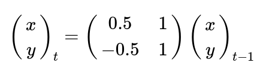
```

In English, the value of $x$ at any time point $t$ is always it's value at the previous time point multiplied by some number $a$.

Finally, we can represent this as a program and visualize how the system behaves with some values for $a$ and $x$ at time $t = 0$. Notice the three key functions for initializing the system, measuring the state of the system, and updating the state of the system.

```{r, eval = FALSE}
# the double arrow <<- assigns to the global environment, 
# not to the function's environment. usually this is not 
# a good idea but these simulations are easy with <<-.

initialize_system <- function() {
    state <<- tibble(id = "foo", a = 1.1, x = 1, time = 0)
    measurements <<- state
}

measure_state <- function() {
    measurements <<- bind_rows(measurements, state)
}

update_state <- function() {
    state <<- mutate(state, x = a * x, time = time + 1)
}

initialize_system()

for (time in 1:50) {
    update_state()
    measure_state()
}
```

We represent the measurements from the simulation visually. The message: exponential systems blow up (like a 50 year investment with a steady return).

```{r, echo = FALSE, eval = FALSE}
anim_save(
    filename = "system-1.gif",
    animation = visualize_state(data = measurements, y = x, x = time)
)
```

```{r, echo = FALSE}
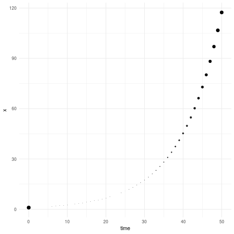
```

## Cyclical behaviour

The next one will be a bit cooler. We'll add another variable, $y$, and pick the following rule.

```{r, echo = FALSE}

```

The programmatic representation is very similar to the previous one.

```{r, eval = FALSE}
initialize_system <- function() {
    state <<- tibble(
        id = "foo", 
        time = 0,
        x = 1,
        y = 1
    )
    
    measurements <<- state
}

measure_state <- function() {
    measurements <<- bind_rows(measurements, state)
}

update_state <- function() {
    state <<- state %>%
        mutate(
            next_x = 0.5 * x + y, 
            next_y = -0.5 * x + y,
            time = time + 1
        ) %>%
        mutate(x = next_x, y = next_y) %>%
        select(-next_x, -next_y)
}

initialize_system()

for (time in 1:50) {
    update_state()
    measure_state()
}

```

And finally, we can visualize the phase space easily since we have two variables and time.

```{r, echo = FALSE, eval = FALSE}
anim_save(
    filename = "system-2.gif",
    animation = visualize_state(measurements, y = y, x = x, time = time)
)
```

```{r, echo=FALSE}
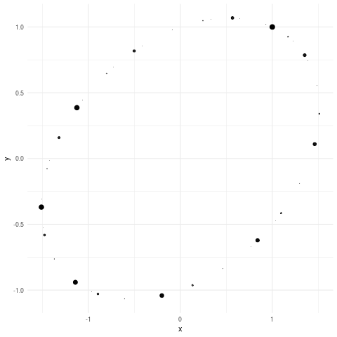
```


## Continuous population growth

What if we want to model time continuously instead? We can use differential equations. Let's try a so-called logistic population growth model.

```{r, echo=FALSE}
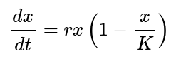
```

In English, the rate of change of the variable $x$ in time $t$ at any particular state is given by the seemingly random calculation on the right with two parameters, $r$ and $K$. Rate of change is clearly proportional to $r$. We can also see that when $x$ is equal to $K$, the rate of change hits zero!

So let's simulate this system with some initial values by approximating it with the corresponding discrete-time model.

```{r, eval = FALSE}
initialize_system <- function() {
    time_step <- 0.1
    
    state <<- tibble(
        id = "foo",
        r = 0.2,
        k = 1,
        x = 0.1,
        time = 0
    )
    measurements <<- state
}

measure_state <- function() {
    measurements <<- bind_rows(measurements, state)
}

update_state <- function() {
    state <<- state %>%
        mutate(
            x = x + r * x * (1 - (x / k)) * time_step,
            time = time + time_step
        )
}

initialize_system()

for (time_steps in 1:500) {
    update_state()
    measure_state()
}
```

```{r, echo = FALSE, eval = FALSE}
anim_save(
    filename = "system-3.gif",
    animation = measurements %>%
        slice(seq(1, 501, by = 10))  %>%
        visualize_state(y = x, x = time)
)
```

```{r, echo=FALSE}
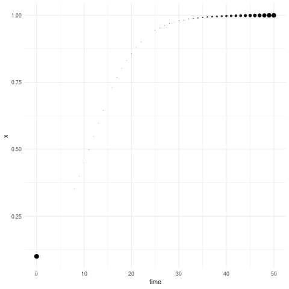
```

Now the variable doesn't blow up indefinitely anymore but approaches the value $K$ that we set to one. We managed to model how actual populations might behave in some situations and the parameter $K$ even has a reasonable interpretation, the carrying capacity of the environment.

## Bifurcations

Let's keep adding complexity slowly. This time we take two variables, $x$ and $y$, and play with the following continuous-time differential equation that demonstrates us a complex behaviour called a _bifurcation_.

```{r, echo = FALSE}
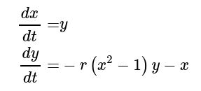
```

Once again, we represent the same system as a program and simulate it with some initial values. This time we also check multiple values of parameters to understand how they affect the system. First, let try $r=-1$.

```{r, eval = FALSE}
initialize_system <- function() {
    time_step <<- 0.01
    
    state <<- tibble(
        r = -1,
        x = 0.1,
        y = 0.1,
        time = 0
    )
    measurements <<- state
}

measure_state <- function() {
    measurements <<- bind_rows(measurements, state)
}

update_state <- function() {
    state <<- state %>%
        mutate(
            x_next = x + y * time_step,
            y_next = y + (-r * (x^2 - 1) * y - x) * time_step,
            time = time + time_step
        ) %>%
        mutate(y = y_next, x = x_next) %>%
        select(-x_next, -y_next)
}

initialize_system()

for (time_steps in 1:1000) {
    update_state()
    measure_state()
}
```

```{r, echo = FALSE, eval = FALSE}
anim_save(
    filename = "system-4-1.gif",
    animation = measurements %>%
        slice(seq(1, 1001, length.out = 50)) %>%
        visualize_state(measurements, x = x, y = y)
)
```

```{r, echo = FALSE}
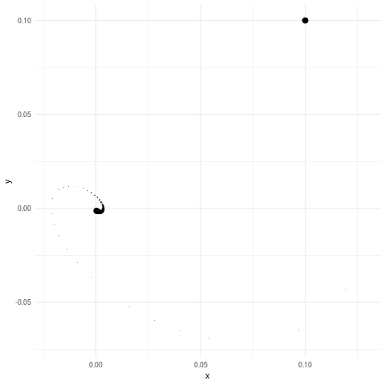
```

That's interesting. How about $r=0$?

```{r, eval = FALSE, echo = FALSE}
initialize_system <- function() {
    time_step <<- 0.01
    
    state <<- tibble(
        r = 0,
        x = 0.1,
        y = 0.1,
        time = 0
    )
    measurements <<- state
}

measure_state <- function() {
    measurements <<- bind_rows(measurements, state)
}

update_state <- function() {
    state <<- state %>%
        mutate(
            x_next = x + y * time_step,
            y_next = y + (-r * (x^2 - 1) * y - x) * time_step,
            time = time + time_step
        ) %>%
        mutate(y = y_next, x = x_next) %>%
        select(-x_next, -y_next)
}

initialize_system()

for (time_steps in 1:1000) {
    update_state()
    measure_state()
}
```

```{r, echo = FALSE, eval = FALSE}
anim_save(
    filename = "system-4-2.gif",
    animation = measurements %>%
        slice(seq(1, 1001, length.out = 50)) %>%
        visualize_state(measurements, x = x, y = y)
)
```

```{r, echo = FALSE}
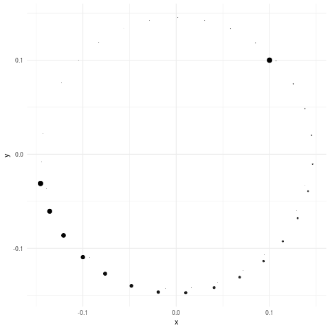
```

So that's much more stable! Can you guess what happens with $r=1$?

```{r, eval = FALSE, echo = FALSE}
initialize_system <- function() {
    time_step <<- 0.01
    
    state <<- tibble(
        r = 1,
        x = 0.1,
        y = 0.1,
        time = 0
    )
    measurements <<- state
}

measure_state <- function() {
    measurements <<- bind_rows(measurements, state)
}

update_state <- function() {
    state <<- state %>%
        mutate(
            x_next = x + y * time_step,
            y_next = y + (-r * (x^2 - 1) * y - x) * time_step,
            time = time + time_step
        ) %>%
        mutate(y = y_next, x = x_next) %>%
        select(-x_next, -y_next)
}

initialize_system()

for (time_steps in 1:1000) {
    update_state()
    measure_state()
}
```

```{r, echo = FALSE, eval = FALSE}
anim_save(
    filename = "system-4-3.gif",
    animation = measurements %>%
        slice(seq(1, 1001, length.out = 50)) %>%
        visualize_state(measurements, x = x, y = y)
)
```

```{r, echo = FALSE}
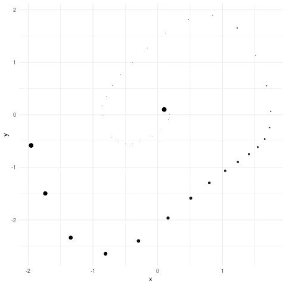
```

Just by comparing those animations you get a pretty good intuition of what bifurcations are. The systems are totally different when the parameter $r$ goes from zero to either -1 or +1.

## Chaos

We're slowly working towards more and more complex systems. Now we'll level up our game to one of the most famous models that shows us _chaotic_ behaviour, Lorenz equations.

```{r, echo = FALSE}
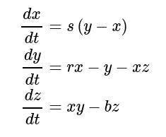
```

Let's pick some values for the parameters $s$, $r$, and $b$, and initial values of $1$ for all variables $x$, $y$, and $z$, and write the program in the usual way.

```{r, eval = FALSE}
initialize_system <- function() {
    time_step <<- 0.01
    
    state <<- tibble(
        r = 30,
        s = 10,
        b = 3,
        x = 1,
        y = 1,
        z = 1,
        time = 0
    )
    measurements <<- state
}

measure_state <- function() {
    measurements <<- bind_rows(measurements, state)
}

update_state <- function() {
    state <<- state %>%
        mutate(
            x_next = x + (s * (y - x)) * time_step,
            y_next = y + (r * x - y - x * z) * time_step,
            z_next = z + (x * y - b * z) * time_step,
            time = time + time_step
        ) %>%
        mutate(
            y = y_next,
            x = x_next,
            z = z_next
        ) %>%
        select(-y_next, -x_next, -z_next)
}

initialize_system()

for (time_steps in 1:1000) {
    update_state()
    measure_state()
}
```

Now that the state or phase space is in three dimensions, we need to get more general visualization tools. One method is to map time to the x-axis and make multiple subplots.

```{r, echo = FALSE, eval = FALSE}
plot <- measurements %>%
    select(-(r:b)) %>%
    slice(seq(1, 1001, length.out = 200)) %>%
    gather("variable", "value", -time) %>%
    ggplot(aes(y = value, x = time)) +
        geom_point(size = 0.5) +
        facet_wrap(facets = vars(variable), ncol = 1) +
        transition_time(time) +
        shadow_trail(distance = 0.01) +
        theme_minimal()

anim_save(
    filename = "system-5-1.gif",
    animation = animate(plot, duration = 5)
)
```

```{r, echo = FALSE}
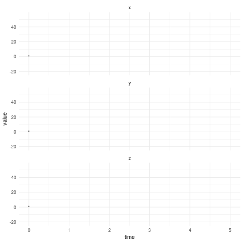
```

Another visualization approach is to take all pairs of variables, including $(x, y)$, $(x, z)$, and $(y, z)$, and visualize these two-dimensional subspaces side-by-side. It requires just a little bit more data wrangling.

```{r, echo = FALSE, eval = FALSE}
plot <- measurements %>%
    select(-(r:b)) %>%
    slice(seq(1, 1001, length.out = 250)) %>%
    rename(x1 = x, y1 = y, z1 = z) %>%
    mutate(x2 = x1, y2 = y1, z2 = z1) %>%
    gather("var1", "value1", x1:z1) %>%
    gather("var2", "value2", x2:z2) %>%
    ggplot(aes(x = value1, y = value2)) +
        geom_point(size = 0.5) +
        facet_grid(rows = vars(var1), cols = vars(var2)) +
        transition_time(time) +
        shadow_trail(distance = 0.01, alpha = 0.5) +
        theme_minimal() +
        theme(axis.title.x = element_blank(), axis.title.y = element_blank())

anim_save(
    filename = "system-5-2.gif",
    animation = animate(plot, fps = 20)
)
```

```{r, echo = FALSE}
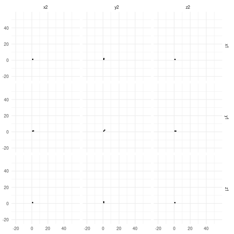
```

The system described by the Lorenz equations clearly has two _attractor states_ –– or phase space areas that the state is attracted to and circulates in this case.

But the state of this Lorenz system is still described by only three variables and we have simulated just one observational unit (point) at a time. So now we move on to systems that have many more units and variables! 

## Random walkers

Let's start by adding units first. This time we skip the mathematical description and start with English. We model a system that consists of a thousand objects that have just two variables, the positions $x$ and $y$, and of course $time$. The rule is that the positions evolve completely randomly.

```{r, eval = FALSE}
initialize_system <- function() {
    time_step <<- 1
    state <<- tibble(
        x = rnorm(1000, 0, 1),
        y = rnorm(1000, 0, 1),
        time = rep(0, times = 1000)
    )
    measurements <<- state
}

measure_state <- function() {
    measurements <<- bind_rows(measurements, state)
}

update_state <- function() {
    state <<- state %>%
        mutate(
            x = x + rnorm(1000, 0, 0.1),
            y = y + rnorm(1000, 0, 0.1),
            time = time + time_step
        )
}

initialize_system()

for (time_steps in 1:1000) {
    update_state()
    measure_state()
}
```

The state/phase space looks just like you'd expect.

```{r, echo = FALSE, eval = FALSE}
anim_save(
    filename = "system-6.gif",
    animation = visualize_state(measurements, x = x, y = y)
)
```

```{r, echo = FALSE}
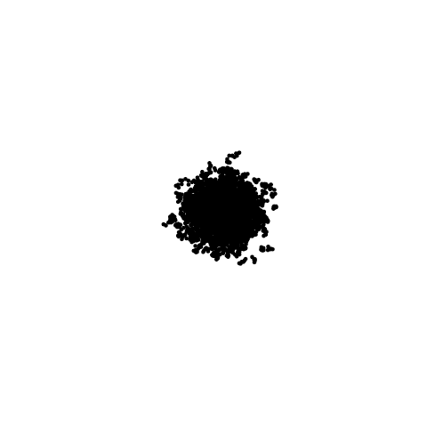
```

## Cellular automata

Now, again, we modify the previous system a bit.

The mathematical description is not very interesting so, in English, we model a system of 1600 objects packed on a grid, or cells, in the same two-dimensional space with variables $x$ and $y$. This time we also add a third variable $a$ and allow _interaction_ between the objects. The basic rule for the system is that if an object has $a=0$, it will switch to $a=1$ _only if_ four or more of its neighbours have $a=1$. Otherwise the object has always $a=0$. The positions of the objects don't change at all.

These kind of systems are called _cellular automata_.

```{r, eval = FALSE}
initialize_system <- function() {
    time_step <<- 1
    n <- 50
    p <- 0.2
    state <<- tibble(
        x = rep(1:n, times = n),
        y = rep(1:n, each = n),
        a = sample(c(0, 1), replace = TRUE, size = n*n, prob = c(1 - p, p)),
        time = rep(0, times = n*n)
    )
    measurements <<- state
}

measure_state <- function() {
    measurements <<- bind_rows(measurements, state)
}

update_state <- function() {
    # neighbors are at (x-1, y-1) and so on
    apply_rule <- function(x_object, y_object, state) {
        state %>%
            filter((x == x_object | x == x_object - 1 | x == x_object + 1) & 
                   (y == y_object | y == y_object - 1 | y == y_object + 1) &
                   !(x == x_object & y == y_object)) %>%
            summarise(a = sum(a)) %>%
            mutate(a = if_else(a > 2, 1, 0)) %>%
            pull(a)
    }
    
    state$a <<- map2_dbl(state$x, state$y, apply_rule, state = state)
    state$time <<- state$time + time_step
}

initialize_system()

pb <- progress::progress_bar$new(total = 20)

for (time_steps in 1:20) {
    pb$tick()
    update_state()
    measure_state()
}
```

Updating many objects' state one-by-one when the state depends on many other objects' states can be very expensive computationally. This is a major challenge in the field in general.

Visualization time. Since we have three variables, $x$, $y$, and $a$, and the first two are positions we can use a new visualization trick (in this post). Namely, we map $x$ and $y$ to position on the axes and $a$ to the color (fill) of the object.

```{r, echo = FALSE, eval = FALSE}
anim_save(
    filename = "system-7.gif",
    animation = visualize_state(measurements, x = x, y = y, color = a)
)
```

```{r, echo = FALSE}
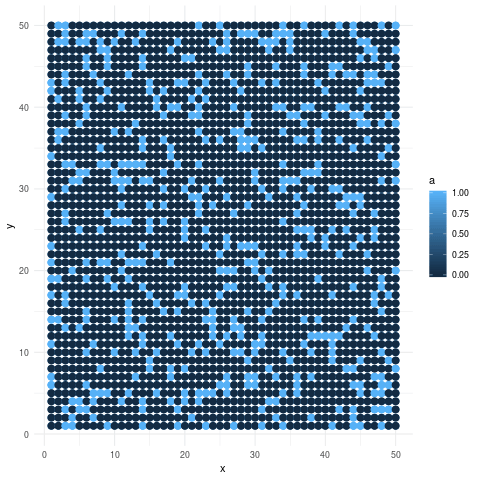
```

That's a neat simple model for many things that can spread from object to object, like panic in a tight space from people to people.

## Continuous field models

A natural extension to the cellular automata is to switch to more continuous variables again. That's how we get _continuous field models_ that can be mathematically described with some new (in this post) technology called _partial differential equations_. We'll play with the following model.

```{r, echo=FALSE}
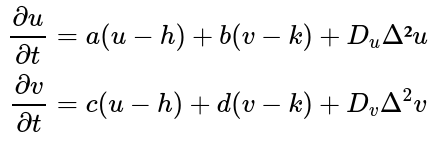
```

This system has two variables $u$ and $v$ for each point in ($x, y$), and time $t$, as well as a total of 8 parameters, $\{a, b, c, d, h, k, D_u, D_v\}$. $\Delta^2$ is the so-called Laplacian operator that's basically the second-order derivative (a measure of convexity) in the direction of the variable that comes after the operator. So, for example, the rate of change of $u$ by time depends on the convexity in the direction of $u$, in math, $\Delta^2u$.

The simple plain language principles that this mathematical model unintuitively describes become much clearer after we try to simulate and visualize the system. (We approximate the Laplacian with a simple cellular automata similar to the one in the previous model.)

> A side-note on simulating continuous systems: we can't simulate continuous functions directly but we need to turn them into some discrete versions. So the differential equations are a more precise description of the system than the discrete program – in some sense. Sometimes the equations are so complicated as a discrete simulator that all of the world's supercomputers are not enough to actually run it accurately (think metereology). We have built models and simulated them in this post but there is the math-heavy approach of understanding these systems via mathetimatical _analysis_ of the models (see the Sayama book for more about the analysis of complex systems).

```{r, eval = FALSE}
initialize_system <- function() {
    # hyperparameters
    n_units <<- 50
    space_step <<- 1 / n_units
    time_step <<- 0.02
    
    state <<- tibble(
        x = rep(1:n_units, times = n_units),
        y = rep(1:n_units, each = n_units),
        u = 1 + runif(n_units*n_units, -0.03, 0.03),
        v = 1 + runif(n_units*n_units, -0.03, 0.03),
        time = 0
    )
    
    measurements <<- state
}

measure_state <- function() {
    measurements <<- bind_rows(measurements, state)
}

update_state <- function() {
    a <- 1
    b <- -1
    c <- 2
    d <- -1.5
    h <- 1
    k <- 1
    du <- 0.0003
    dv <- 0.00018

    # model for a single cell
    apply_rule <- function(x_object, y_object, n_units, state) {
        
        # for border cells, return state unchanged
        # otherwise run the model forward
        if (x_object == 1 | x_object == n_units | 
            y_object == 1 | y_object == n_units) {
            
            state %>%
                filter(x == x_object, y == y_object)
            
        } else {
            
            time_now <- state$time[1]
            
            state %>%
                select(-time) %>%
                # classify cells, up, down, left, right, center, not neighbour
                mutate(cell = case_when(
                    x == x_object + 1 & y == y_object ~ "right",
                    x == x_object - 1 & y == y_object ~ "left",
                    x == x_object & y == y_object + 1 ~ "up",
                    x == x_object & y == y_object -1 ~ "down",
                    x == x_object & y == y_object ~ "center",
                    TRUE ~ "not neighbour"
                )) %>%
                filter(!(cell == "not neighbour")) %>%
                # reformat data: get variables like center_u, left_u, etc.
                mutate(cell_u = str_c(cell, "_u"), cell_v = str_c(cell, "_v")) %>%
                select(-x, -y, -cell) %>%
                spread(cell_u, u) %>%
                spread(cell_v, v) %>%
                summarise_all(sum, na.rm = TRUE) %>%
                mutate(x = x_object, y = y_object) %>%
                # laplacians
                mutate(
                    lap_u = (right_u + left_u + down_u + up_u - 4 * center_u) / 
                            (space_step^2),
                    lap_v = (right_v + left_v + down_v + up_v - 4 * center_v) / 
                            (space_step^2)
                ) %>%
                # finally run the model forward for one time step
                transmute(
                    u = center_u + (a * (center_u - h) + 
                             b * (center_v - k) + du * lap_u) * time_step,
                    v = center_v + (c * (center_u - h) + 
                             d * (center_v - k) + dv * lap_v) * time_step,
                    x = x,
                    y = y,
                    time = time_now
                )
            
        }
    }
    
    # run model for each cell
    state <<- map2_dfr(
        state$x, 
        state$y, 
        apply_rule, 
        state = state, 
        n_units = n_units
        ) %>%
        mutate(time = time + time_step)
}

initialize_system()

pb <- progress::progress_bar$new(total = 10)

for (time_steps in 1:10) {
    pb$tick()
    update_state()
    measure_state()
}
```

We apply the same visualization technique as before for $u$ and $v$ separately.

```{r, echo = FALSE, eval = FALSE}
anim_save(
    filename = "system-8-1.gif",
    animation = visualize_state(measurements, x = x, y = y, color = u)
)

anim_save(
    filename = "system-8-2.gif",
    animation = visualize_state(measurements, x = x, y = y, color = v)
)
```

```{r, echo = FALSE}
knitr::include_graphics("system-8-1.gif")
knitr::include_graphics("system-8-2.gif")
```

Unfortunately, almost nothing seems to happen with the parameters used but we get the idea. Continuous fields are like continuous versions of cellular automata.

## Dynamical network models

Next, we dive into _dynamical network models_. To represent them, we'll need to add some mathematical language of graph theory into our toolbox.

We'll focus on the so-called adaptive networks because they combine both the dynamics _on_ and _of_ networks, i.e., they allow both the nodes (objects, units, people) and the edges (unit relationships, friendship, physical contact) to change. If the previous modelling tools felt too restricted, adaptive networks are a very general framework for modelling complex sets of assumptions.

We'll model and simulate the following adaptive network model.

```{r, echo = FALSE}
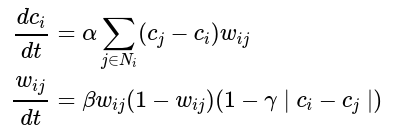
```

In natural language, we have a bunch of units indexed with $i$ with some state given by its variable $c$. The rate of change of the state by time $t$ depends on the unit's neighbors' states (indexed with $j$) like in previous models. However, this time we have also the variable $w$ that is a variable of the _relationships_ between the neighbors, noted by the $ij$ subscripts. In graph theory language, $c$ is a node variable and $w$ is an edge variable, and because they both change, we have an adaptive network model. 

This particular model has been developed to be a simplified sociological model of groups of people and social contagion.

Let's simulate a famous network called the karate club that initially contains two distinct groups with states $c=0.9$ and $c=0.1$ and all of the existing relationships have weight $w=0.4$. As usual, we pick some values for the other parameters and see what happens. (Again, a quick and dirty implementation I'm afraid...)

```{r, eval = FALSE}
initialize_system <- function() {
    # hyperparameters
    a <<- 1
    b <<- 3
    g <<- 3
    time_step <<- 0.01
    
    timer <<- 0
    # the first graph
    graph <<- karate %>%
        as_tbl_graph() %>%
        mutate(c = if_else(Faction == 1, 0.9, 0.1)) %>%
        select(name, c) %>%
        mutate(time = timer) %>%
        activate(edges) %>%
        rename(w = weight) %>%
        mutate(w = 0.4, time = timer) %>%
        activate(nodes)
    
    # measure graph and time separately for now
    measured_graph <<- graph
    measured_time <<- timer
}

measure_state <- function() {
    measured_graph <<- graph %N>%
        mutate(time = timer) %E>%
        mutate(time = timer) %N>%
        bind_graphs(measured_graph)
    
    measured_time <<- append(measured_time, timer)
}

update_state <- function() {
    
    # mote the c and w equations
    # here we define them first and
    # then apply them below
    c_model <- function(neighborhood, graph, node) {
        # get neighborhood data
        nc <- neighborhood %>% 
            as_tibble(active = "nodes") %>%
            filter(row_number() != node) %>%
            pull(c)
        nw <- neighborhood %>%
            as_tibble(active = "edges") %>%
            filter(from == node | to == node) %>%
            pull(w)
        # get graph data
        gc <- graph %>%
            as_tibble(active = "nodes") %>%
            pull(c)
        
        # run the discretized c equation
        gc[node] + (a * (sum((nc - gc[node]) * nw)) * time_step)
        
    }
    
    w_model <- function(graph) {
        gc <- graph %>%
            as_tibble(active = "nodes") %>%
            pull(c)
        
        # the discretized model
        dwdt <- function(w, b, g, c_from, c_to, time_step) {
            w + b * w * (1 - w) * (1 - g * abs(c_from - c_to)) * time_step
        }
        
        graph %>%
            as_tibble(active = "edges") %>%
            mutate(
                next_w = dwdt(w, b, g, gc[from], gc[to], time_step)
            ) %>%
            pull(next_w)
    }
    
    graph <<- graph %N>%
        mutate(next_c = map_local_dbl(.f = c_model)) %E>%
        mutate(next_w = w_model(graph = graph)) %>%
        select(-w) %>%
        rename(w = next_w) %N>%
        select(-c) %>%
        rename(c = next_c)
    
    timer <<- timer + time_step
    
}

initialize_system()

while (timer < 2) {
    update_state()
    measure_state()
}
```

```{r, echo = FALSE, eval = FALSE}
animation::saveGIF({
    for (t in measured_time) {
    
        plot <- measured_graph %N>%
            filter(time == t) %E>%
            filter(time == t) %>%
            visualize_adaptive_net(time = t)
        
        print(plot)
    }
    }, 
    interval = 0.05,
    movie.name = "system-9.gif"
)
```

```{r, echo = FALSE}
knitr::include_graphics("system-9.gif")
```

So the model predicts that the two groups polarize as time goes on. Whether this is actually an accurate sociological model for some kind of state and relationship is another topic but it's surely a precise and testable description of a hypothesis, like all science aims to be!

## Agent-based models

Finally, we dive into the last modelling framework in this post and it is the most general of them all: _agent-based models_. 

Agent-based models are most naturally described in the language of [object-oriented programming](https://en.wikipedia.org/wiki/Object-oriented_programming) instead of graph theory and equations because each node (unit, agent) can be arbitrarily complex and interact with other agents as well as with arbitrarily complex environments. 

But because agent-based modelling is general, you can basically use it as the framework to model the most simple systems too which makes it a really powerful tool.

Let's build a model 200 agents with features $x$, $y$, and *type*. The rule is that the agents jump randomly in the grid until they find a neighborhood with a certain proportion of agents of the same type. You could think of this as another simple model of social segregation.

Let's get coding.

```{r, eval = FALSE}
initialize_system <- function() {

    n_agents <<- 200
    radius <<- 0.2
    threshold <<- 0.6

    # classes have upper-cased first letters by general convention
    # we use R's Reference Class (RC) system; it works just like Python classes etc.
    Agent <<- setRefClass(
        Class = "Agent",
        # variables
        fields = list(
            id = "numeric",
            type = "numeric", 
            x = "numeric", 
            y = "numeric", 
            time = "numeric"
        )
    )
    
    measurements <<- tibble(.rows = 0)
    
    agents <<- list()
    for (i in 1:n_agents) {
        agent <- Agent()
        
        agent$id <- i 
        agent$type <- rbinom(n = 1, size = 1, prob = 0.5)
        agent$x <- runif(n = 1, min = 0, max = 1)
        agent$y <- runif(n = 1, min = 0, max = 1)
        agent$time <- 0
        
        agents <<- append(agents, agent)
    }
}

measure_state <- function() {

    for (agent in agents) {
        
        agent_state <- tibble(
            id = agent$id,
            type = agent$type, 
            x = agent$x, 
            y = agent$y, 
            time = agent$time
        )
        
        measurements <<- bind_rows(measurements, agent_state)
    }
}

update_state <- function() {
    
    next_agents <- list()
    # shuffle order of agents
    agents <<- sample(agents)
    
    for (agent in agents) {
        
        neighbor_types <- c()
        for (neighbor in agents) {
            
            distance <- ((agent$x - neighbor$x)^2 + (agent$y - neighbor$y)^2)
            is_within_radius <- distance < radius^2
            not_self <- agent$id != neighbor$id
            is_neighbor <- not_self & is_within_radius
            
            if (is_neighbor == TRUE) {
                neighbor_types <- append(neighbor_types, neighbor$type)
            }
        }
        
        if (length(neighbor_types) > 0) {
            
            proportion_same_type <- sum(neighbor_types == agent$type) / 
                                    length(neighbor_types)
            
            if (proportion_same_type < threshold) {
                agent$x <- runif(n = 1, min = 0, max = 1)
                agent$y <- runif(n = 1, min = 0, max = 1)
            }
            
        }
        
        agent$time <- agent$time + 1
        
        next_agents <- append(next_agents, agent)
    }
    
    agents <<- next_agents
}

initialize_system()

pb <- progress::progress_bar$new(total = 20)

for (i in 1:20) {
    pb$tick()
    
    update_state() 
    measure_state()
}
```

```{r, echo = FALSE, eval = FALSE}
anim_save(
    filename = "system-10.gif",
    animation = visualize_state(
        measurements, 
        x = x, 
        y = y, 
        color = type,
        group = id,
        wake_length = 0
    )
)
```

```{r, echo = FALSE}
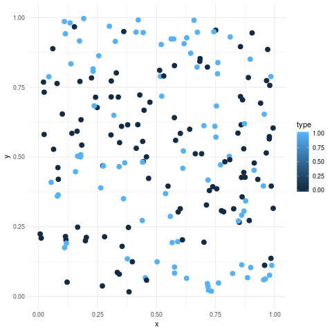
```

## Conclusion

In summary, we got some intuition on dynamical equations, cellular automata, networks models, and agent-based models. To cotinue your journey to the wonderful world of complex systems, I recommend reading the book [here](https://textbooks.opensuny.org/introduction-to-the-modeling-and-analysis-of-complex-systems/).

```{r, echo = FALSE}

```

## Extra notes

I used the following packages and functions in the post.

```{r, eval = FALSE}
library(tidyverse)
library(tidygraph)
library(gganimate)
library(ggraph)

library(igraphdata)
data(karate)

visualize_state <- function(data, ..., alpha = 0.2, wake_length = 0.9, size = 3) {
    
    spec <- ggplot(data = data, aes(...)) +
        geom_point(size = size) +
        transition_states(time) +
        ease_aes("linear") +
        shadow_wake(wake_length = wake_length, alpha = alpha) +
        theme_minimal()

    animate(spec, duration = 5)
   
}

visualize_adaptive_net <- function(graph, time) {
    plot <- graph %>%
        ggraph(layout = "kk") +
            geom_node_point(aes(color = c), size = 4) +
            geom_edge_fan(aes(alpha = w, width = w)) +
            scale_color_gradient(low = "white", high = "black", limits = c(0, 1)) +
            scale_edge_width(range = c(0, 2), limits = c(0, 1)) +
            scale_edge_alpha_continuous(limits = c(0, 1)) +
            theme_graph() +
            ggtitle(str_c("Time: ", round(time, 2)))
    
    return(plot)
}

```

