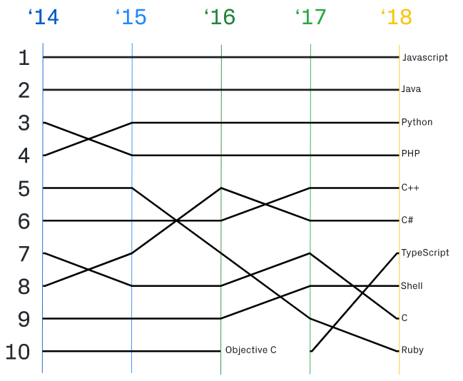

+++
title = "Introduction to Programming Languages"
date = "2019-11-09"
+++

Today we will learn about programming languages by making 10 small programs in the 10 most popular programming languages (in GitHub open-source projects in 2018). Just read the code; I've tried to explain things line-by-line in the comments. The goal is just to get a feel for what programming languages look like.

</img>

## 1. JavaScript

```html
<!DOCTYPE html>
<meta charset="utf-8">
<body>
<!-- 
- weird arrows for HTML comments
- we use browser to run our javascript; must be embedded in html -->
<!-- first get set of programs called d3 directly from internet --> 
<script src="https://d3js.org/d3.v3.min.js"></script>
<script>
// javascript goes here
</script>
```

```javascript
// double front slash for JavaScript comments
// define size of window
// const throws error if anyone reassigns to same name
// comma allows listing assignments on single row
const width = 960, height = 500;
// define circles as data objects with features
// { key: value } is a data structure
// represent circle as { key: value, ... } data structure
// range() creates many of them [{ : }, { : }, ...]
// map adds "radius: random" to each { : } object
let nodes = d3.range(0, 200, 1).map(generateRandom);
// first { : } object (node) represents cursor tip
let root = nodes[0];
root.radius = 0;
root.fixed = true;
// get and configure a force simulation program
// force becomes { key: function(), start: start(), ... }
const force = d3.layout.force()
    .gravity(0.05)
    .charge(setCharge)
    .nodes(nodes)
    .size([width, height]);
// add main svg html-tag to body-tag
// svg (support vector graphics) is html for drawing
// svg variable is now [[<svg ... >]] data structure
let svg = d3.select("body")
    .append("svg")
    .attr("width", width)
    .attr("height", height);

const color = d3.scale.category10();

function getColor(node, index) { return color(index % 3); }

// add circle-tags to the svg first time
function initializeCircles() {
  // create placeholders for circle-tags to svg
  svg.selectAll("circle")
    // bind data (except the first root node) to svg
    .data(nodes.slice(1))
    // when circles should appear to page...
    .enter()
    // ...add circle-tags to the svg
    .append("circle")
    // set radiuses of circle-tags to one from data
    .attr("r", getRadius)
    // set color of circle-tags to ones from coloring program
    .style("fill", getColor);
}

// Math is a built-in set of mathematical programs
function generateRandom() { 
  return { radius: Math.random() * 12 + 4 }; 
}
// "? :" is short-hand syntax for "if else"
// all index numbers except 0 evaluate to true
function setCharge(node, index) { return index ? 0 : -2000; }
function getRadius(node) { return node.radius; }
// category10() from d3.scale returns a coloring function
function updatePositions(error) {
  // quadtree transforms data so that no need to compare all pairs
  let q = d3.geom.quadtree(nodes),
      i = 0,
      n = nodes.length;
  // 
  while (++i < n) q.visit(makeCollisionFunction(nodes[i]));

  svg.selectAll("circle")
      // anonymous getter functions
      // set circle-tag positions to ones from data
      .attr("cx", function(node) { return node.x; })
      .attr("cy", function(node) { return node.y; });
}

function updateRoot() {
  var p1 = d3.mouse(this);
  root.px = p1[0];
  root.py = p1[1];
  force.resume();
}

function makeCollisionFunction(node) {
  var r = node.radius + 16,
      nx1 = node.x - r,
      nx2 = node.x + r,
      ny1 = node.y - r,
      ny2 = node.y + r;
  return function(quad, x1, y1, x2, y2) {
    if (quad.point && (quad.point !== node)) {
      var x = node.x - quad.point.x,
          y = node.y - quad.point.y,
          l = Math.sqrt(x * x + y * y),
          r = node.radius + quad.point.radius;
      
      if (l < r) {
        l = (l - r) / l * .5;
        node.x -= x *= l;
        node.y -= y *= l;
        quad.point.x += x;
        quad.point.y += y;
      }
    }
    
    return x1 > nx2 || x2 < nx1 || y1 > ny2 || y2 < ny1;
  
  };
}
// start force simulation
force.start();
// draw first circles
initializeCircles();
// for each tick of time, update positions
force.on("tick", updatePositions);
// for each move of mouse, update position of mouse (root)
svg.on("mousemove", updateRoot);
```

## 2. Java

```java
// public allows use of class outside package
// everything must be absracted to classes in Java
public class Java {
 	// static means a method of class, not of object made from it
 	// void means doesn't return data
 	// String is data type, [] means array
 	// main method is called if class is called
	public static void main(String[] args) {
		// make new array of numbers
		int numbers[] = new int[]{32,43,53,54,32,65,63,98,43,23};
		// initialize variables; [0] means first item in array
		int smallest = numbers[0];
		int largest = numbers[0];
		// from index 1 until index of last number, one-by-one
		for (int i = 1; i < numbers.length; i++) {
			// if larger, set as largest
			if (numbers[i] > largest) {
				largest = numbers[i];
			// if smaller, set as smallest
			} else if (numbers[i] < smallest) {
				smallest = numbers[i];
			}	
		}
		// built-in System.out has println to print to terminal
		System.out.println("Largest Number is : " + largest);
		System.out.println("Smallest Number is : " + smallest);
	}
}
// compile program with "javac" command line program
// run compiled program with "java" command line program
```

## 3. Python

```python
# import gets object from known paths
# as renames object
import numpy as np
import matplotlib.pyplot as plt
from matplotlib.collections import LineCollection
# scikit-learn for data science
from sklearn.linear_model import LinearRegression
from sklearn.isotonic import IsotonicRegression
from sklearn.utils import check_random_state
# goal: make random data, fit two different models, plot results
n = 100
# np has function arange; makes array from 0 to n
x = np.arange(n)
# check_random_state returns instance of class RandomState
rs = check_random_state(seed = 0)
# rs object has method randit to make random numbers
y = rs.randint(-50, 50, size = (n, )) + 50. * np.log1p(np.arange(n))
# get instance of class IsotonicRegression
ir = IsotonicRegression()
# fit isotonic regression model to data
y_ = ir.fit_transform(x, y)
# get instance of LinearRegression
lr = LinearRegression()
# fit linear regression model to data
# x was array of length 100
# x[:, np.newaxis] is array for arrays of length 1
lr.fit(x[:, np.newaxis], y)
# segments is pairs of [x, y] points; prediction and data
# data structure is [[[x, y], [x, y_]], ...] 
segments = [[[i, y[i]], [i, y_[i]]] for i in range(n)]
# matplotlib has data structure called LineCollection
lc = LineCollection(segments, zorder = 0)
lc.set_array(np.ones(len(y)))
lc.set_linewidths(np.full(n, 0.5))
# matplotlib.pyplot allows building plot with various methods
plt.plot(x, y, 'r.', markersize=12)
plt.plot(x, y_, 'b.-', markersize=12)
plt.plot(x, lr.predict(x[:, np.newaxis]), 'b-')
plt.gca().add_collection(lc)
plt.legend(('Data', 'Isotonic Fit', 'Linear Fit'), loc='lower right')
plt.title('Isotonic regression')
plt.show()
```

## 4. PHP

```php
<!DOCTYPE html>

<?php
# variables have $ in php
$cookie_name = "user";
$cookie_value = "Alex Porter";
# setcookie sends a cookie to the browser (server runs php)
setcookie($cookie_name, $cookie_value, time() + (86400 * 30), "/");
?>

<html>
<body>

<?php
# $_COOKIE[$cookie_name] accesses $cookie_value
if (!isset($_COOKIE[$cookie_name])) {
  echo "Cookie named '" . $cookie_name . "' is not set!";
} else {
    echo "Cookie '" . $cookie_name . "' is set!<br>";
    echo "Value is: " . $_COOKIE[$cookie_name];
}
?>

<p><strong>Note:</strong> You might have to reload the page to see the new value of the cookie.</p>
</body>
</html>
```

## 5. C++

```cpp
// include iostream (cout) declarations here
// actual code exists in std library
#include <iostream>
// allow writing cout instead of str::cout
using namespace std;
// define class
class Car {
  // declare attributes; data types always needed, values not
  // public means accessible outside class
  public:
    string brand;   
    string model;
    int year;
};
// main function is always run
// returned data type must be declared
int main() {
  // declare new objects of class Car
  // set values to attributes
  Car car1;
  car1.brand = "BMW";
  car1.model = "X5";
  car1.year = 1999;
  Car car2;
  car2.brand = "Ford";
  car2.model = "Mustang";
  car2.year = 1969;
  // c++ way to print to console
  std::cout << car1.brand << " " << car1.model << " " << car1.year << "\n";
  std::cout << car2.brand << " " << car2.model << " " << car2.year << "\n";
  // return nothing (zero)
  return 0;
}
// compile with g++ command line utility
// run compiled program as ./program
```

## 6. C\#

```csharp
// allow direct use of programs (types) in two libraries (namespaces)
using Microsoft.ML.Probabilistic.Models;
using Microsoft.ML.Probabilistic.Distributions;
// all code must be organized into "namespaces" in c sharp
namespace csharp {
  // ... and classes
  class Program {
    // static makes Main method belong to Program class, not its particular instance
    // void means no return value
    // Main is run when file is run
    // string[] defines text array data structure
    static void Main(string[] args) {
      // angle bracket syntax is called generics
      // generics help write classes/methods that work with any data type
      // new keyword creates an object of supplied class (runs constructor)
      // observe boolean data of class VariableArray for treatment and control group
      VariableArray<bool> controlGroup = Variable.Observed(new bool[] { false, false, true, false, false });
      VariableArray<bool> treatedGroup = Variable.Observed(new bool[] { true, false, true, true, true });
      // indeces for patients in both groups of class Range
      Range i = controlGroup.Range; 
      Range j = treatedGroup.Range;
      // assume 50% probability for treatment being effective before data
      Variable<bool> isEffective = Variable.Bernoulli(0.5);
      // pre-declare probability of good outcome for both groups
      Variable<double> probIfTreated, probIfControl;
      // "using" defines scope at the end of which object is disposed
      // if treatment is effective, different probabilities of good outcome
      using (Variable.If(isEffective)) {
        // assume probability of good outcome Beta(1, 1) before data
        probIfControl = Variable.Beta(1, 1);  
        probIfTreated = Variable.Beta(1, 1);  
        // each patient gets true/false with that probability
        // "array[index] = value" assigns value to position index in array
        controlGroup[i] = Variable.Bernoulli(probIfControl).ForEach(i);  
        treatedGroup[j] = Variable.Bernoulli(probIfTreated).ForEach(j);  
      }
      // if treatment not effective, same probability of good outcome
      using (Variable.IfNot(isEffective)) {
        // assume probability of good outcome Beta(1, 1) before data
        Variable<double> probAll = Variable.Beta(1, 1);
        controlGroup[i] = Variable.Bernoulli(probAll).ForEach(i);  
        treatedGroup[j] = Variable.Bernoulli(probAll).ForEach(j);  
      }
      // get instance of class InferenceEngine for learning from data
      InferenceEngine ie = new InferenceEngine();
      // Infer returns input variable after observing data
      string effect = ie.Infer(isEffective).ToString();
      // mean of beta distribution is the most probable probability
      float treated = (float)ie.Infer<Beta>(probIfTreated).GetMean();
      float control = (float)ie.Infer<Beta>(probIfControl).GetMean();
      // output to results to console with WriteLine from System.Console
      System.Console.WriteLine("Probability of effect = " + effect);
      System.Console.WriteLine("Probability of good outcome if treatment = " + treated);  
      System.Console.WriteLine("Probability of good outcome if control = " + control);
    }
  }
}
// build and run with .NET dotnet command line utility
// 1. dotnet new console (create new console app project folder)
// 2. dotnet add package Microsoft.ML.Probabilistic.{Models, Compiler, Learners}
// 3. write current .cs file to that folder
// 4. dotnet run (in project folder) 
```

## 7. TypeScript

```javascript
// we can use classes and constructors
// constructors run when class is instantiated
class Student {
  // define property and its data type
    name: string;
    // can use access control keywords too; public allows access outside class block
    constructor(public first: string, public middle: string, public last: string) {
        // this keyword points to instantiated object (example below)
        this.name = first + " " + middle + " " + last;
    }
}
// interfaces allow defining a type of object; much like string or boolean
interface Person {
    first: string;
    last: string;
}
// function that only accepts input of type Person defined above
function greeter(person: Person) {

    return "Hello, " + person.first + " " + person.last;
}
// create new object of class Student; input values go to constructor
let user = new Student("User", "U.", "Userson");
// object has properties first and last of type string; hence type Person
// add function output to html DOM body
document.body.textContent = greeter(user);
```

## 8. Shell

```bash
#!/bin/bash
# define function
get_files () {
  # ls returns filenames that match its argument
  # * matches anything, including nothing
  # set result to global variable
  file_names="`ls *.html`"
}
# another function for counting lines
count_lines () {
  # local means variable cannot be accessed outside function
  # $1 is special and refers to first argument
  local file_name=$1
  # wc -l prints newline counts
  # | pipes left-side output as right-side input
  # sed edits text; s refers to substitute, rest is regex
  line_count=`wc -l $file_name | sed 's/^\([0-9]*\).*$/\1/'`
}
# conditions go inside [ ]
# $# -ge 1 means number of script arguments greater or equal to 1
# so if arguments given...
if [ $# -ge 1 ]
then
  echo "Error: Use without arguments."
  exit 1
fi
# set internal field separator as newline character, excludes space and tab
IFS=$'\012'
# initialize counters
line_count=0
file_count=0
line_count_sum=0
# run get_files; populates file_names list data structure
get_files
# loop over file_names
for file_name in $file_names
do
  count_lines $file_name
  # print result to terminal
  echo "$file_name: $line_count"
  # math operations within [ ]
  # need $ to make return value a variable
  file_count=$[ $file_count + 1 ]
  # increase sum of all lines
  line_count_sum=$[ $line_count_sum + $line_count ]
done
# print result to terminal
echo "$file_count files in total, with $line_count_sum lines in total"
```

## 9. C

```c
// include header file stdio.h here
// contains standard input output programs
#include <stdio.h>
 // main is run when program is run 
// must define type of return data
int main() {
    // declare 3 variables, define 1
    int number, reversed = 0, remainder, original;
    // output to terminal (stdin)
    printf("Enter an integer: ");
    // input from terminal
    // %d means integer, &number means address of variable number
    scanf("%d", &number);
    // value in address &number is original input
    original = number;
    // reverse number with modulo math
    // != means "is not equal to"
    while (number != 0) {
        // % means modulo; returns last digit in input
        remainder = number % 10;
        // set last number first
        reversed = reversed * 10 + remainder;
        // "x /= y" is short for "x = x / y"
        number /= 10;
    }
    // palindromes are same in either direction
    if (original == reversed)
        printf("%d is a palindrome.\n", original);
    else
        printf("%d is not a palindrome.\n", original);
    // must return something; 0 used for nothing
    return 0;
}
//compile with gcc filename.c
//run executable compiled program with ./filename
```

## 10. Ruby

```ruby
#!/usr/bin/ruby -w
# def to define function like in Python but without colon
def longest_repetition(string)
  # method chaining in ruby
  max = string
          .chars
          .chunk(&:itself)
          .map(&:last)
          .max_by(&:size)
  # short-hand syntax for if-else
  max ? [max[0], max.size] : ["", 0]
end
# run program with "ruby" command line tool
```